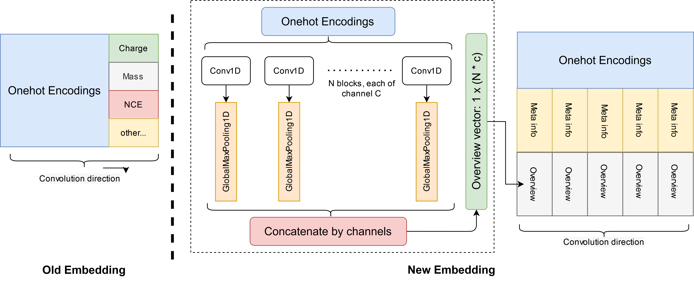
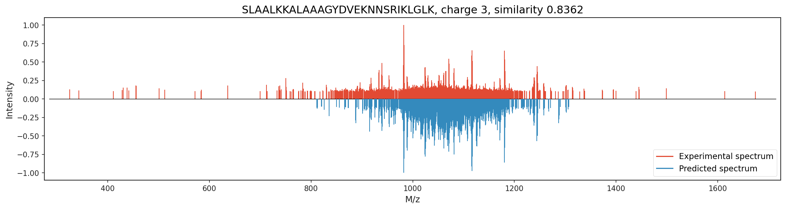
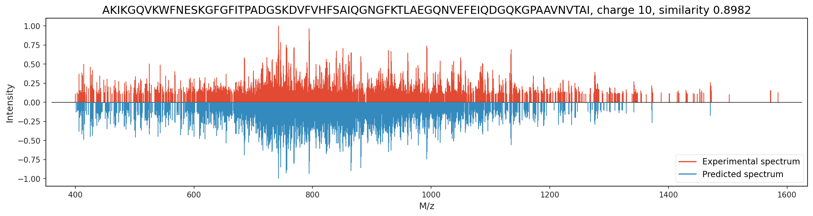

# PredLong

The first model for predicting complete tandem mass spectra from LONG peptides sequences.

Free for academic uses.

## Update History

* 2024.05.01: First version.

## Method

This model follows the main structure of [Predfull](https://github.com/lkytal/PredFull), but with significant change of the input embedding

### Important Notes

* This model assumes a __FIXED__ carbamidomethyl on C
* The maximum input charge is 30+
* The prediction will NOT output peaks with M/z > 2000

### Required Packages

Recommend to install dependency via [Anaconda](https://www.anaconda.com/distribution/)

* Python >= 3.9
* Tensorflow >= 2.14.0
* Pandas >= 0.20
* pyteomics
* lxml

## How to build & train the model

Simply run:

`python train_model.py --input example.mgf --output model.h5`

## Prediction Examples

__Note that intensities are shown by square rooted values__

CID example:

HCD example:

